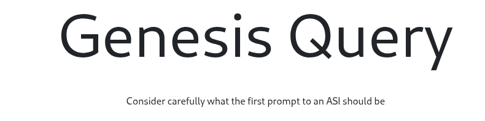

<div align="center">

# Genesis Query



</div>

Genesis Query is a web application built with Flask that lets users submit and vote on prompts for ASI. Each user can leave a comment (prompt) and upvote others. The app displays the country flag of each user based on their IP, and includes pagination for browsing top-voted prompts.

## Run Locally

1. Create and activate a virtual environment:

```bash
python3 -m venv venv
source venv/bin/activate
```

2. Install the dependencies:

```bash
pip install -r requirements.txt
```

4. Start the Flask application:

```bash
python app.py
```

5. Access the web interface at [http://localhost:5000](http://localhost:5000).